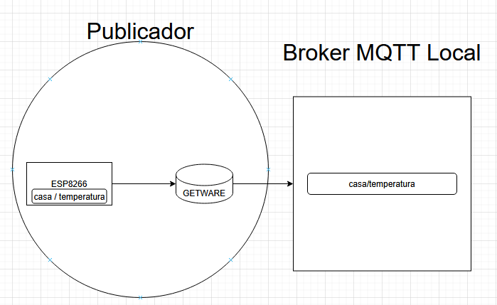

# IoT-MQTT-ESP8266

## Descrição

Este projeto implementa um sistema de **telemetria** utilizando o protocolo MQTT para coletar dados de sensores (simulados em um ESP8266) e transmiti-los para um servidor local para monitoramento e visualização.

## Tecnologias e Conceitos Utilizados

* **ESP8266:** Microcontrolador utilizado para simular a coleta de dados de um sensor e publicar essas informações.
* **MicroPython: v1.24.1** Firmware Python rodando no ESP8266.
* **MQTT (Message Queuing Telemetry Transport):** Protocolo de publicação/subscrição leve para comunicação entre o ESP8266, o broker local e o servidor local.
* **Broker MQTT Local:** Servidor MQTT rodando na rede local da indústria, responsável por intermediar a comunicação MQTT.
* **Servidor Local:** Um servidor (potencialmente rodando Python) que atua como um cliente MQTT (assinando os dados do broker local).

## Arquitetura do Sistema

1.  **Coleta de Dados (ESP8266):** O ESP8266 (simulando um sensor) coleta dados (ex: status da conexão com a rede) e os publica como mensagens MQTT no **Broker MQTT Local** em um tópico específico (ex: `casa/temperatura/`).
2.  **Comunicação Local (MQTT):** O **Servidor Local** se inscreve no tópico `casa/temperatura/` do **Broker MQTT Local** via MQTT para receber os dados em tempo real.
3.  **Integração com a Nuvem (Opcional - Bridging MQTT):** O **Broker MQTT Local** pode ser configurado para enviar (fazer um "bridge") dados específicos para um **Broker MQTT na Nuvem**, permitindo acesso remoto.

## Fluxo de Dados Detalhado

1.  O ESP8266 (publicador) envia dados do sensor para o Broker MQTT Local via Wi-Fi usando o protocolo MQTT.
2.  O Broker MQTT Local recebe a mensagem e a encaminha para todos os assinantes interessados.

## Próximos Passos e Considerações

* Implementação do código MicroPython no ESP8266 para simular a leitura do sensor e a publicação MQTT.
* Configuração e execução de um Broker MQTT Local (ex: Mosquitto).
* (Opcional) Configuração de um Broker MQTT na Nuvem (ex: AWS IoT Core, Google Cloud IoT Core) e o "bridging" entre os brokers.
* Desenvolvimento do Servidor Local (em Python com Flask ou outra framework) para atuar como cliente MQTT e servidor HTTP.
* Criação do Painel de Visualização (HTML, CSS, JavaScript) para exibir os dados consumidos do Servidor Local via HTTP.
* Exploração dos diferentes níveis de Qualidade de Serviço (QoS) no MQTT para garantir a confiabilidade da entrega dos dados.

Este README fornece um panorama da arquitetura de monitoramento da indústria 4.0 utilizando MQTT e HTTP (em breve), conforme discutido. A implementação prática envolverá a configuração de cada componente de software e hardware detalhadamente.